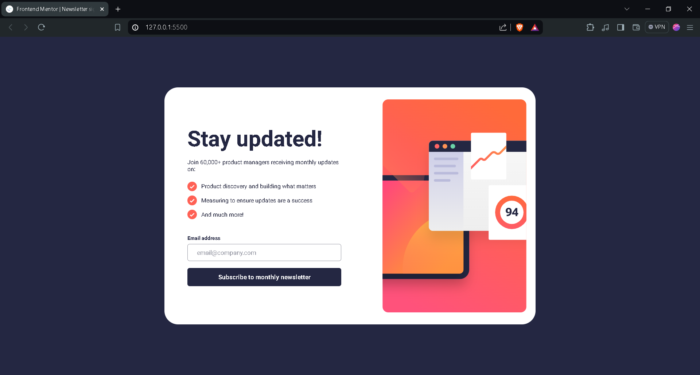
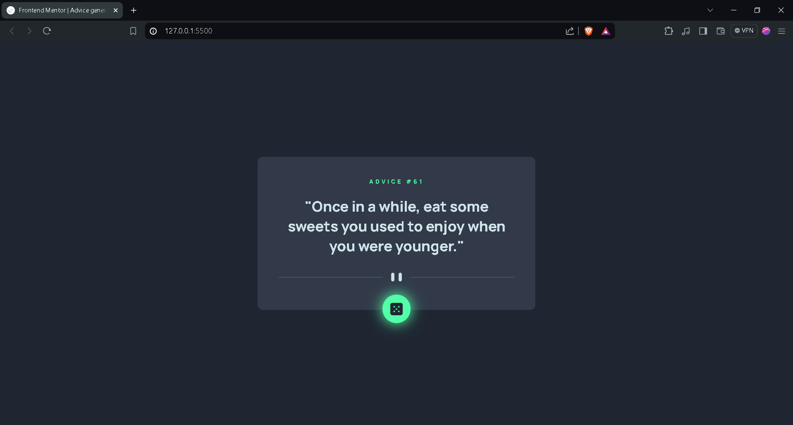
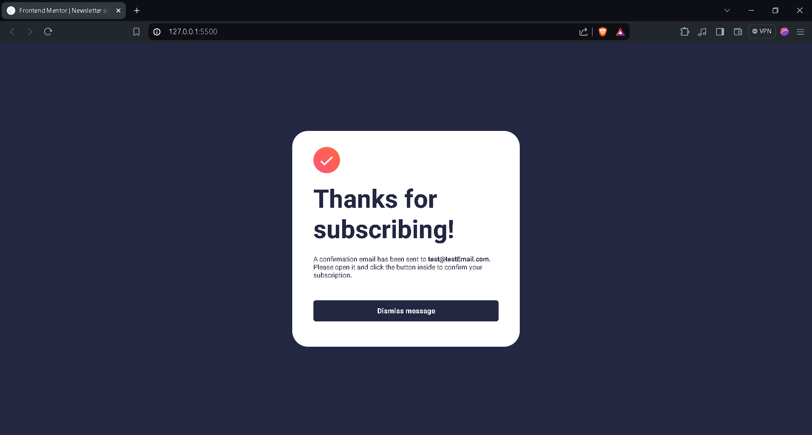
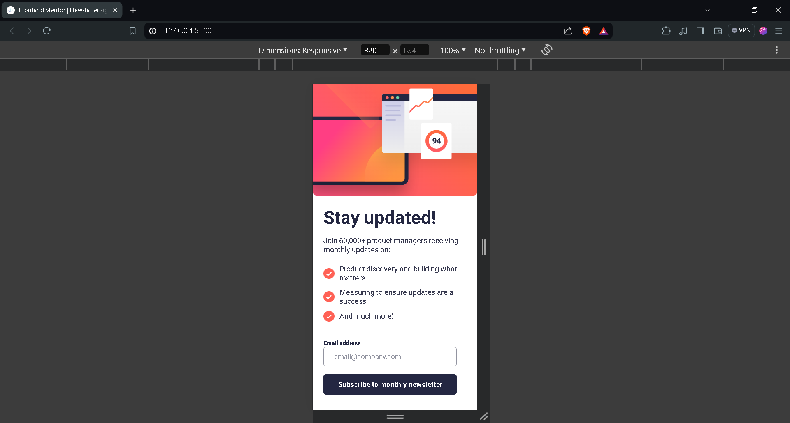
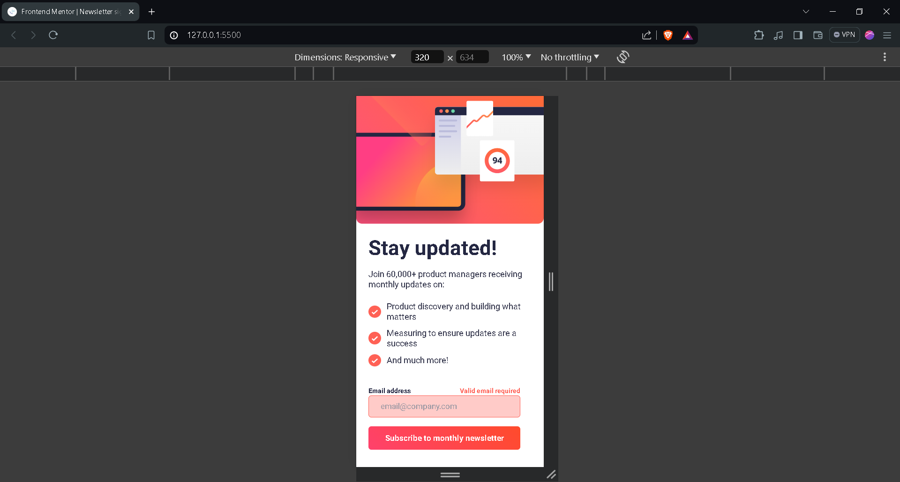
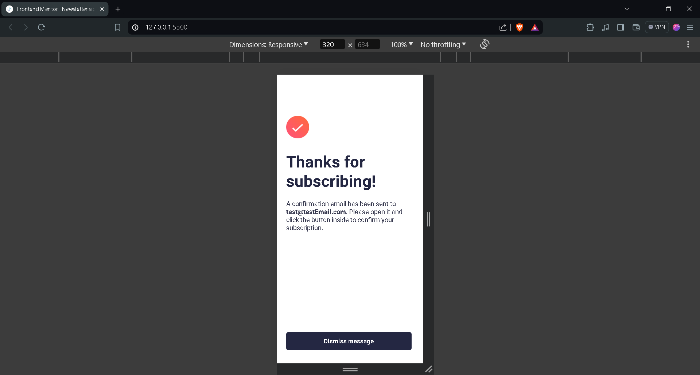

# Frontend Mentor - Newsletter Sign-Up Form with Success Message Solution

This is a solution to the [Newsletter Sign-Up Form with Success Message challenge on Frontend Mentor](https://www.frontendmentor.io/challenges/newsletter-signup-form-with-success-message-3FC1AZbNrv). Frontend Mentor challenges help you improve your coding skills by building realistic projects.

## Table of Contents

- [Overview](#overview)
  - [The Challenge](#the-challenge)
  - [Screenshots](#screenshots)
  - [Links](#links)
- [My Process](#my-process)
  - [Built With](#built-with)
  - [What I Learned](#what-i-learned)
  - [Continued Development](#continued-development)
- [Author](#author)

## Overview

### The Challenge

Users should be able to:

- Add their email and submit the form.
- See a success message with their email after successfully submitting the form.
- See form validation messages if:
  - The field is left empty.
  - The email address is not formatted correctly.
- View the optimal layout for the interface depending on their device's screen size.
- See hover and focus states for all interactive elements on the page.

### Screenshots

#### Desktop View - Initial View



#### Desktop View - Active State



#### Desktop View - Error State


#### Desktop View - Thank You State



#### Mobile View - Initial View



#### Mobile View - Error State



#### Mobile View - Thank You State



### Links

- Solution URL: [https://www.frontendmentor.io/solutions/newsletter-sign-up-form-with-success-message-jXxexBTjew](https://www.frontendmentor.io/solutions/newsletter-sign-up-form-with-success-message-jXxexBTjew)
- Live Site URL: [https://bright-zabaione-96d81d.netlify.app/](https://bright-zabaione-96d81d.netlify.app/)

## My Process

### Built With

- HTML
- CSS
- JavaScript

### What I Learned

In this project, I learned how to validate email addresses using JavaScript and how to make the website responsive across different devices. Here are some code snippets that illustrate these concepts:

#### HTML

```html
<p>A confirmation email has been sent to <strong id="emailId">ash@loremcompany.com</strong>. 
Please open it and click the button inside to confirm your subscription.</p>
```
```css
#dissMsg:hover {
    background: linear-gradient(45deg, #ff416c, #ff4b2b);
}
```
```javascript
function validateEmail() {
    const emailRegex = /^[^\s@]+@[^\s@]+\.[^\s@]+$/;
    if (emailRegex.test(emailInput.value)) {
        return true;
    } else {
        return false;
    }
}
```

### Continued Development

I plan to focus on making the site responsive across all screen sizes to ensure an optimal user experience on any device.

## Author

- Name - Ayush Verma
- Frontend Mentor - [@a-yush101](https://www.frontendmentor.io/profile/a-yush101)
