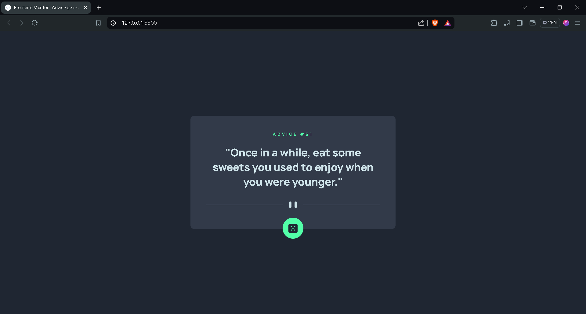
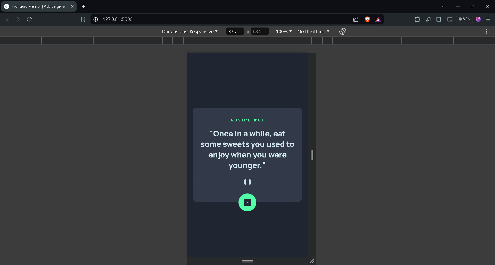
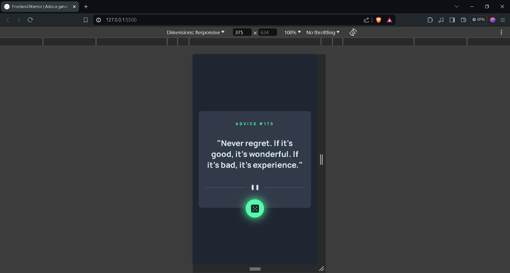

# Frontend Mentor - Advice generator app solution

This is a solution to the [Advice generator app challenge on Frontend Mentor](https://www.frontendmentor.io/challenges/advice-generator-app-QdUG-13db). Frontend Mentor challenges help you improve your coding skills by building realistic projects.

## Table of contents

- [Overview](#overview)
  - [The challenge](#the-challenge)
  - [Screenshots](#screenshots)
  - [Links](#links)
- [My process](#my-process)
  - [Built with](#built-with)
  - [What I learned](#what-i-learned)
  - [Continued development](#continued-development)
- [Author](#author)

## Overview

### The challenge

Users should be able to:

- View the optimal layout for the app depending on their device's screen size
- See hover states for all interactive elements on the page
- Generate a new piece of advice by clicking the dice icon

### Screenshots

#### Desktop View


#### Desktop Active State


#### Mobile View


#### Mobile Active State


### Links

- **Solution URL**: [View Solution](https://www.frontendmentor.io/solutions/advice-generator-app-97ImU6P_uB)
- **Live Site URL**: [View Live Site](https://stupendous-scone-eb5838.netlify.app/)

## My process

### Built with

- Semantic HTML5 markup
- CSS custom properties
- Flexbox
- CSS Grid
- Mobile-first workflow

### What I learned

- I learned how to use the `fetch` method in JavaScript to retrieve data from APIs using async/await.

  ```JavaScript
  async function randomize() {
    try {
        const response = await fetch("https://api.adviceslip.com/advice");
        if (!response.ok) {
            throw new Error('Network response was not ok');
        }
        const data = await response.json();
        adviceNo.innerText = `ADVICE #${data.slip.id}`;
        adviceText.innerText = `"${data.slip.advice}"`;
    } catch (error) {
        console.error('There has been a problem with your fetch operation:', error);
    }
  }
  ```

- I also learned how to add interactive styles using CSS.
```CSS
/* Example of adding a hover effect with CSS */
.randomize:hover {
  box-shadow: 0px 0px 25px 1px var(--Neon_Green);
}
```

### Continued development

- I want to improve user experience and refine the responsiveness of the site.

## Author

- **Name**: Ayush Verma
- **Frontend Mentor**: [@a-yush101](https://www.frontendmentor.io/profile/a-yush101)
